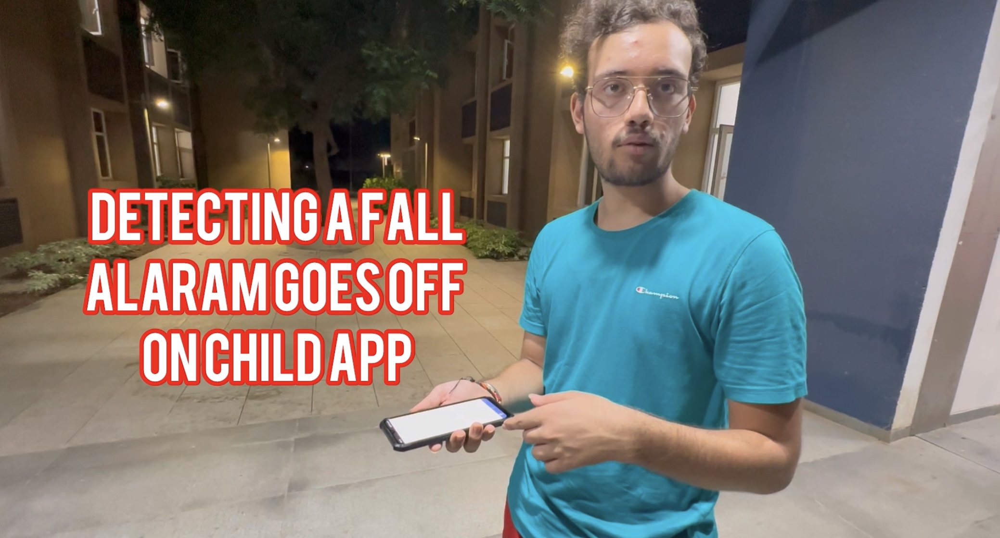

# Child Safety Monitoring App

## **Objectives of the App**

1. The App Continuously monitors the **GPS**, **accelerometer**, and **gyroscope data** of your phone (the CHILD) to determine the following

* **Over speed**
* **Fall detection** (negating false falls -> Bumps, Turns, Ascent & Descent)
* **Boundary crossing** (CHILD Device goes beyond a circular perimeter)

2. If the cycle goes beyond a particular perimeter, or over speeds, the device does the following:
- Plays a beep alarm sound on the CHILD device.
- Display the real-time location of the CHILD on the PARENT Device using custom created map projection and plays a beep sound on the PARENT device too.
  
3. If the cycle falls, the app does:
- Plays a beep alarm sound on the CHILD device, with an option to switch OFF the alarm.
- Display the real-time location of the CHILD device on the PARENT device using the same custom image map and plays a beep sound on the PARENT device.
- If the alarm is not switched OFF within 5 seconds by the CHILD, the microphone of the CHILD device is automatically switched on and starts recording and sends this live audio to the PARENT device.

**Communication is established between both the server and client devices using TCP/IP model connected over a common network -> which is the IITGN-SSO in our case.**
